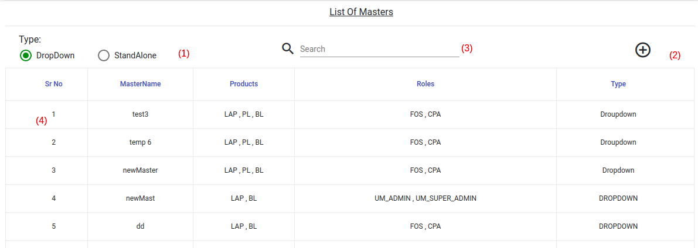
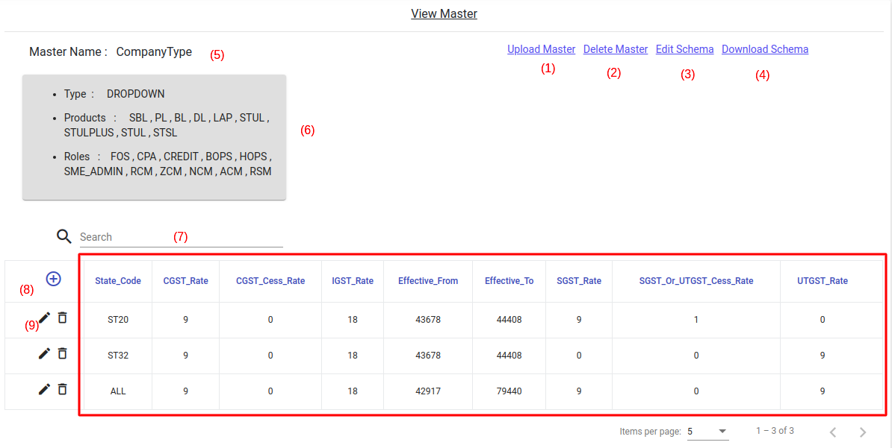
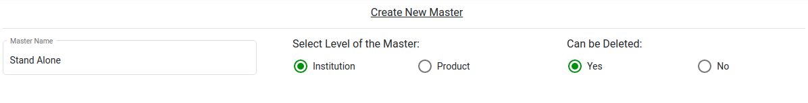
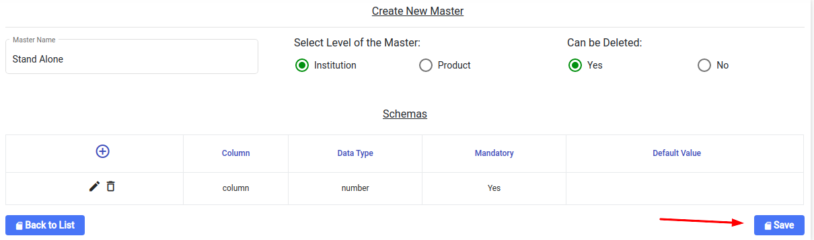
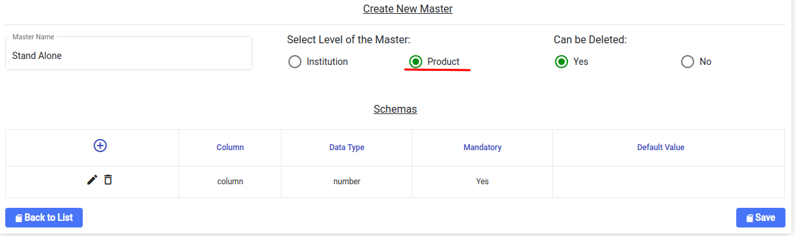
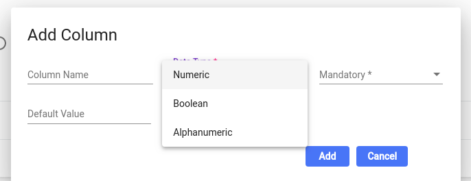
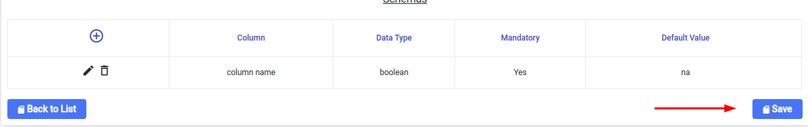
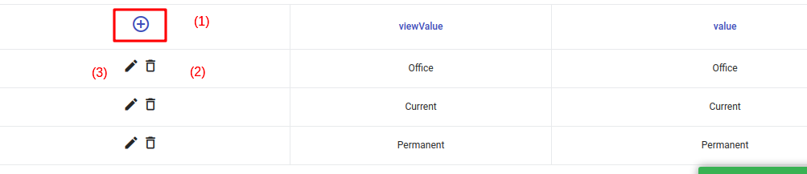
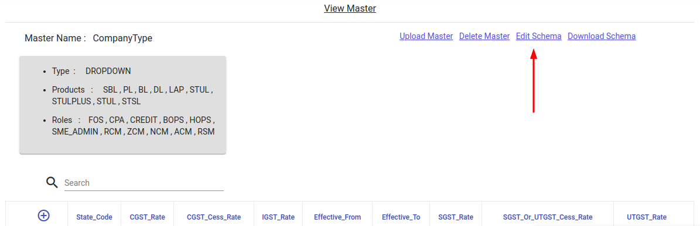

# Master Maintenance

## View Masters List

1. Select the master type you want to see using the radio button
2. Using the plus button, you can create the new master. New master will be created for the selected master type i.e Dropdown or Standalone
3. You can search the master using the search box. The search will happen on the “Master Name”
4. You can click each record to go inside the master. By Default the master list is paginated and you can go to the next page by navigating the pages at the bottom of the screen

## View One Master

The description of each button is given below as per the numbers mentioned in the screen.&#x20;

1. Upload master using excel file
2. Delete master (Only can be deleted if the master is allowed to be deleted)
3. Edit Schema: You can edit the product / role tagging and the add / remove columns in the master
4. Download Schema: You can download sample master file excel file
5. Master name
6. MAster metadata will be shown for reference purpose
7. You can search any data using any column of the master
8. You can add a new record to the master
9. You edit / delete record of the master
10. Red box shows actual master data. It will be paginated and you can use the pages at the bottom to navigate

## How to create Standalone master at institute level

Step1: Click on the “ + “ button to go to create master screen

Follow the below steps

* Enter master name. The name should be unique
* Select Institution as level for master
* If master is allowed to be deleted then mark it as “Yes”
* Then add the columns and their data type for the respective master.
* Click on SAVE.
* You will be redirected to the view master screen
* Download the master Schema. Fill the data inside it and then upload it

## How to create Standalone master at Product level

Follow the below steps

* Enter master name. The name should be unique
* Select “Product” as level for master
* If master is allowed to be deleted then mark it as “Yes”
* Then add the columns and their data type for the respective master.
* Click on SAVE.
* You will be redirected to the view master screen
* Download the master Schema. Fill the data inside it.
* While uploading the master, Select the product first and then upload it

## How to create dropdown master

.png>)

Follow the below steps

* Enter master name. The name should be unique
* Tick all the products for which you want to tag this master
* Tick all the roles for which you want to tag this master
* If master is allowed to be deleted then mark it as “Yes”
* Click on "Is Dependant Master" if you have to tag this master as dependant. The details process is [here](untitled-1.md#dependent-dropdown-masters) . If this is ticked, then selecting the dependant Parent master is mandatory
* Then add the columns and their data type for the respective master.

* Click on SAVE.

* You will be redirected to the view master screen
* Download the master Schema. Fill the data inside it and then upload it

Know more about [Schemas](untitled.md)

## How to upload master

For uploading it first time

* Click on Download Schema button
* You will get blank file with columns names pre filled
* Enter the data and then click on “upload master” button
* Select the excel file and then click Upload

For uploading it second time

* Click on “Download Master” button
* You will get master file with columns pre filled with data
* Enter / Edit the data and then click on “upload master” button
* Select the excel file and then click Upload

Append Master To Existing Records

.png>)

* If the records are only to appended to the existing records, then click on the "Append to Existing" flag
* This will help you to add only the incremental records. Ex: If initially there are 100 records and you want to add new 2 records. Then create excel file with 20 records and upload it by checking the flag

## How to perform record level operations

Operations

1. Add Record. Use the “ + “ button
2. Delete Record: Use the Dump icon
3. Edit Record: Use the pencil icon

## Edit Schemas

You can edit schemas by clicking on the edit schema


If the a new column is marked as mandatory, then it will be initialized with the default value in the existing master. If the next master also has the new column as blank then it will throw validation error

